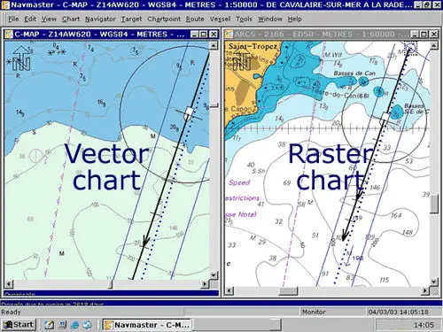
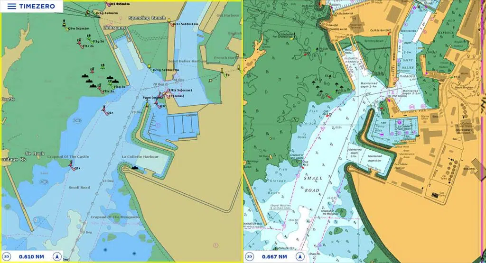
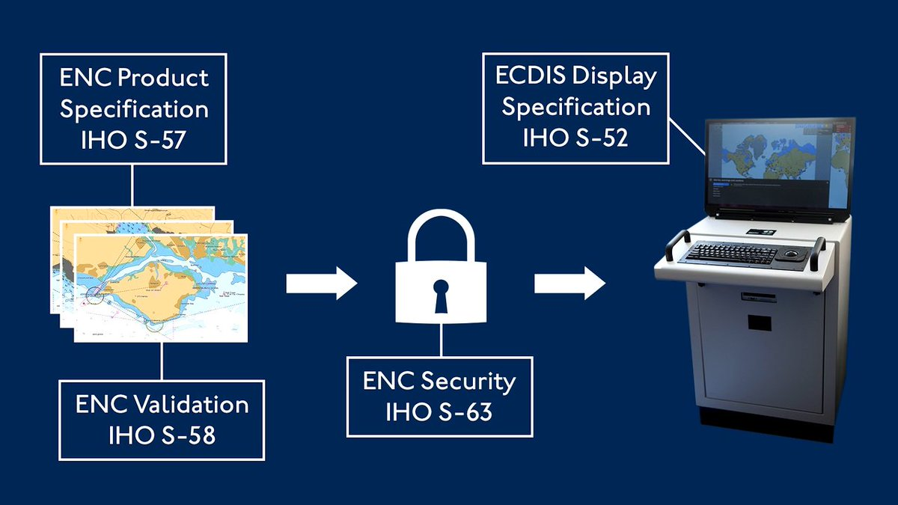
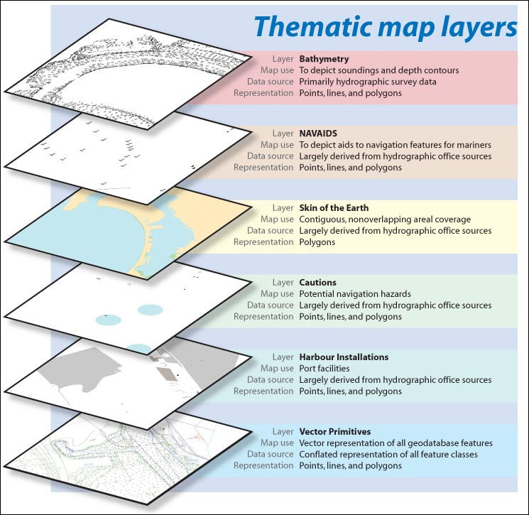
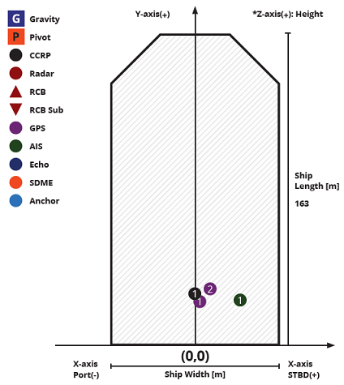
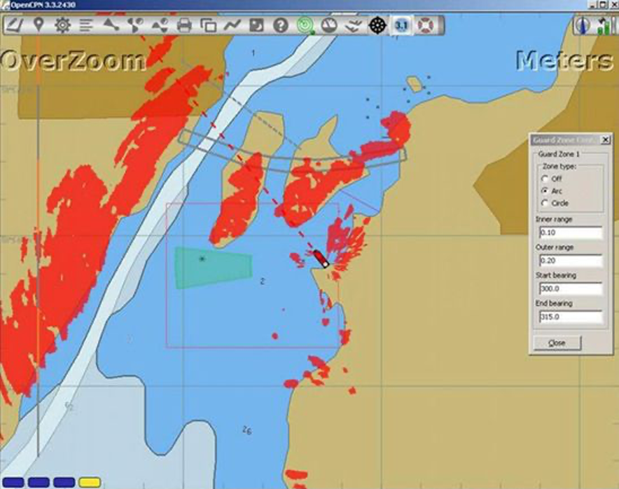

# Cartografía Náutica Electrónica (ENC) bajo estándares IHO

## 01. Definiciones generales

-   **ENC (Electronic Nautical Chart / Carta Náutica Electrónica)**  
    Base de datos vectorial georreferenciada y estructurada siguiendo estándares IHO. Contiene información hidrográfica necesaria para la navegación segura. No es una simple imagen: los objetos poseen atributos, clases y relaciones.

-   **IHO (International Hydrographic Organization / Organización Hidrográfica Internacional)**  
    Entidad internacional que define estándares globales para la producción, almacenamiento, distribución y visualización de datos hidrográficos y náuticos.

-   **ECDIS (Electronic Chart Display and Information System)**  
    Sistema certificado para navegación primaria, capaz de operar ENC oficiales conforme a estándares S-52, S-57 y S-63.

---

## 02. Tipos de cartas náuticas

### **Carta en Papel**

-   Basada en representación gráfica estática.
-   Escala fija y dependiente del formato físico.
-   Requiere actualización manual.
-   Útil como respaldo y referencia tradicional, pero con limitaciones dinámicas.

### **Raster Chart**

-   Imagen digital de una carta en papel (escaneada).
-   No interactiva: objetos no son identificables como entidades digitales.
-   Georreferenciada, pero sin atributos consultables.
-   **Problemas frecuentes**
    -   Pixelado al aumentar zoom.
    -   Dificultad para actualizar capas.
    -   Inconsistencias visuales y solapamiento gráfico.

| Pixelado                                             | Solapamiento                                                  | Correcciones                                                       |
| ---------------------------------------------------- | ------------------------------------------------------------- | ------------------------------------------------------------------ |
|  |  |  |

### **Raster+**

-   Extensión del formato Raster.
-   Incluye capa suplementaria con objetos de información.
-   Parcialmente enriquecida, pero no cumple todas las ventajas del modelo ENC.

### **ENC IHO**

-   Formato vectorial avanzado.
-   Información distribuida en **celdas (Cells)**, sin restricción física de tamaño.
-   Objeto = entidad digital con atributos y lógica propio.
-   Permite:
    -   Interrogación de objetos.
    -   Aplicación de reglas ECDIS para seguridad.
    -   Actualizaciones diferenciales (patches, updates).
    -   Control de capas, simbología, filtrado y escalas de visualización.
-   El aspecto visual final depende del **motor de render basado en S-52** y no del archivo ENC.

**Sintetizando:**
| Tipo | Digital | Interactivo | Actualizable | Base | Pensado para Navegación |
|------|---------|------------|--------------|------|--------------------------|
| Papel | No | No | Manual | Impreso | Respaldo/tradicional |
| Raster | Sí | No | Difícil | Imagen | Secundario |
| Raster+ | Sí | Parcial | Media | Imagen + Data | Mejorado |
| ENC | Sí | Sí | Automático diferencial | Vector + BD | Estándar Primario (ECDIS) |

---

## 03. Estándares relacionados

-   **S-52**: Especificaciones para presentación visual en ECDIS (colores, símbolos, prioridades).
-   **S-57**: Formato y estructura de datos para ENC (catálogo de objetos y atributos, codificación).
-   **S-63**: Sistema de seguridad y licenciamiento para distribución de ENC oficiales (encriptación).
-   **S-101** (próxima generación): Reemplazo de S-57 dentro del marco S-100. Mayor semanticidad y flexibilidad.

---

## 04. Estructura técnica de una ENC

### Componentes principales

-   **Cells**: Unidad básica de cobertura.
-   **Objetos**: Boyas, sondas, líneas batimétricas, peligros, puertos, límites, áreas.
-   **Atributos**: Valor textual o numérico asociado al objeto (ej: profundidad, color, tipo).
-   **Capas**: Visualización agrupada por tipo y funcionalidad.
-   **Metadatos**: Información de origen, fecha, calidad y agencia productora.

### Jerarquía visual (simplificada)

-   Base layer (batimetría, líneas de costa)
-   Señalización marítima
-   Instalaciones portuarias
-   Servicios y restricciones
-   Datos dinámicos (AIS, Radar Overlay, etc.)

### Escalas y uso por nivel de detalle

| Tipo de Cell | Escala aproximada | Uso                     |
| ------------ | ----------------- | ----------------------- |
| Overview     | < 1:1.500.000     | Planificación global    |
| General      | ~1:350.000        | Tránsito oceánico       |
| Coastal      | ~1:180.000        | Navegación costera      |
| Approach     | ~1:90.000         | Aproximación a puertos  |
| Harbour      | ~1:22.000         | Operación portuaria     |
| Berthing     | >1:10.000         | Maniobra fina y atraque |

---

## 05. Documentación oficial (recomendado de lectura)

-   Portal oficial IHO: https://iho.int/en/standards-and-specifications
-   S-57 ENC Portrayal: https://iho.int/en/s-57-enc-portrayal
-   Catálogo de Objetos S-57 (OBJ1, atributos, códigos): https://iho.int

---

## 06. Conceptos importantes

-   **CCRP – Consistent Common Reference Point**  
    Punto común de referencia para fusionar información (Radar, AIS, ENC) de forma coherente.  
    Video introductorio: https://www.youtube.com/watch?v=UXLP8xRrphs

-   **Safety Contour**  
    Límite dinámico de profundidad usado por ECDIS para alarmas automáticas.

-   **CATZOC**  
    Indicador de calidad de datos hidrográficos para evaluar confiabilidad del fondo.

-   **Overlays comunes en ECDIS**
    -   AIS Targets
    -   Radar Reflectivity Layer
    -   Mapa meteorológico/OLA
    -   TSS, AtoN, rutas recomendadas

---

## 07. Flujo completo de producción de una ENC

1. Recolección de datos hidrográficos (batimetría, levantamientos SH).
2. Procesamiento en software cartográfico (CARIS, qGIS con plugins, ESRI).
3. Clasificación y validación según catálogo de objetos S-57.
4. Exportación como ENC CELLS.
5. Validación con herramientas oficiales IHO.
6. Distribución mediante S-63 cifrado.
7. Actualizaciones periódicas del organismo hidrográfico.

---

## 08. Herramientas y librerías

-   Visualización C++:  
    https://help.perforce.com/visualization/views/current/Content/Maps/The_S57_Map_Reader.htm
-   OpENCView (lector S-52 y ENC):  
    https://github.com/sduclos/S52/tree/master
-   Navico Radar Plugin para openCPN (ejemplo de integración Radar + ENC):  
    
    https://github.com/keesverruijt/BR24radar_pi/releases

-   Software profesional hidrográfico:
    -   CARIS HPD/BASE Editor
    -   ESRI ArcGIS + extensiones marítimas
    -   QGIS + S-57 plugins (lectura)

---

## 09. TO-DO propuesto (inicial)

-   [ ] Renderizar ENC y mostrar atributos de objetos.
-   [ ] Implementar visualización multi-capa.
-   [ ] Georreferenciación WGS84 + grilla.
-   [ ] Manejar lógica de capas y prioridad S-52.
-   [ ] Radar Overlay + CCRP Integration.
-   [ ] Buffer de movimiento y memoria gráfica.
-   [ ] API para consulta de objetos ENC.
-   [ ] contacto con SIHN (Servicio de Hidrografía Naval Argentino).
    -   [ ] Solicitar dataset S-57 oficial.
    -   [ ] Procesar y recortar capas de interés con CARIS.

---

## 10. Glosario breve

| Término | Significado                                |
| ------- | ------------------------------------------ |
| ENC     | Carta náutica electrónica                  |
| ECDIS   | Sistema de navegación certificado          |
| Raster  | Imagen digital sin objetos vectoriales     |
| S-57    | Estándar de datos ENC actual               |
| S-101   | Próximo estándar basado en S-100           |
| CCRP    | Punto común de referencia para sensores    |
| CATZOC  | Índice de calidad de datos hidrográficos   |
| AtoN    | Aids to Navigation / Señalización marítima |

---
